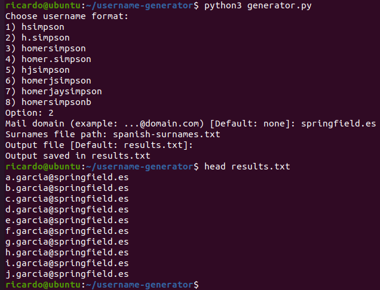

# username-generator

Generate list of possible usernames for attacks such as password spraying 

Formats:

- 1 - Initial + Surname - **hsimpson**
- 2 - Initial + dot + Surname - **h.simpson**
- 3 - Name + Surname - **homersimpson**
- 4 - Name + dot + Surname - **homer.simpson**
- 5 - Initial1 + Initial2 + Surname - **hjsimpson**
- 6 - Name + Initial2 + Surname - **homerjsimpson**
- 7 - Name1 + Name2 + Surname - **homerjaysimpson**
- 8 - Name + Surname + Sufix - **homersimpsonb**

You can optionally add (or skip by pressing enter):

- A mail domain - **hsimpson@springfield.es**
- A domain - **SPRINGFIELD\hsimpson**

Default output file is *results.txt* but you can specify other file
